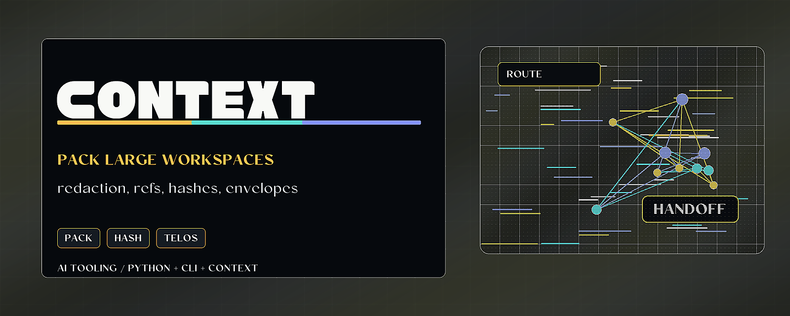

# Context Curator Lite



> Build token-efficient context bundles with redaction, source refs, hashes, and Telos envelopes.

Context Curator Lite extracts planning fragments from local text files, applies
heuristic redaction, and emits compact context bundles for agent session
continuity. It can also emit Project Telos context envelopes for receipt-chained
large-workspace handoffs.

## Why it matters

Large codebases cannot be pushed into a model as raw text forever. This tool
keeps context small, reviewable, and replayable by preserving source references,
content hashes, and expansion commands instead of only compressed prose.

## Try it

```bash
python -m pip install -e ".[test]"
context-curator-lite --root . --out-dir ./artifacts --telos-envelope
python -m pytest
```

## What to test first

- Run a local context bundle over a small repo.
- Inspect `curated-session-context-manifest.json`.
- Generate `project-telos-context-envelope.json` with `--telos-envelope`.

## Current status

Python package and CLI for local context preparation. Redaction is heuristic and
the generated bundle still requires human review before sharing.

## Existing technical notes

> Extract planning fragments and apply heuristic redaction to trim model context.

[](LICENSE)


[](https://github.com/HarperZ9/context-curator-lite/actions/workflows/ci.yml)

[](https://harperz9.github.io)

`context-curator-lite` extracts planning-like fragments from local text files,
redacts secret-shaped values heuristically, and emits a compact context bundle
for session continuity.

It can also emit a Project Telos context envelope for large-workspace agent
work. The compact summary stays reviewable and token-efficient, while each item
keeps source refs, content hashes, and expansion commands so future agents can
replay the context from the original files instead of trusting compressed prose.

The utility is lightweight by design. It helps a human prepare bounded context;
it is not a security boundary or a replacement for review before sharing.
Generated bundles use relative source references and root hashes instead of
absolute local paths.

## Install

```bash
python -m pip install context-curator-lite
```

## Usage

```bash
context-curator-lite --root . --out-dir ./artifacts
context-curator-lite --root . --out-dir ./artifacts --limit 120 --per-file-limit 8
context-curator-lite --root . --out-dir ./artifacts --telos-envelope
```

Each run writes three files into `--out-dir`: a dated Markdown summary, a dated
JSONL bundle, and `curated-session-context-manifest.json` (also echoed to
stdout). See [USAGE.md](USAGE.md) for the full CLI/Python reference, worked
examples, and expected output. A runnable demo lives in
[`examples/demo.py`](examples/demo.py).

With `--telos-envelope`, the run also writes
`project-telos-context-envelope.json` using the
`project-telos.context-envelope/v1` shape. The envelope is designed for the
Gather -> Index -> Forum -> Crucible -> Telos workflow: it avoids absolute
paths, does not copy raw transcripts, marks hidden payloads as disabled, and
records that test evidence is unverifiable unless a downstream tool attaches
that receipt.

## Notes

- It is an agent-assisted tool and should be used with human review of the
  generated context.
- Redaction is heuristic and not a security boundary.
- Absolute root paths are omitted from generated bundles by default.

## Release Notes

- 0.2.0: Project Telos context-envelope export for receipt-chained large-context work.
- 0.1.0: initial package extraction and CLI.

---
**Zain Dana Harper** -- small tools with explicit edges.
[Portfolio](https://harperz9.github.io) | [HarperZ9](https://github.com/HarperZ9)
<sub>Built with Claude Code; reviewed, tested, and owned by me.</sub>

## For developers

Keep the public README, package metadata, and examples aligned with current behavior. Before opening a PR or pushing a release, run the local package verification path.

```bash
python -m pip install -e ".[test]"
python -m pytest
```
